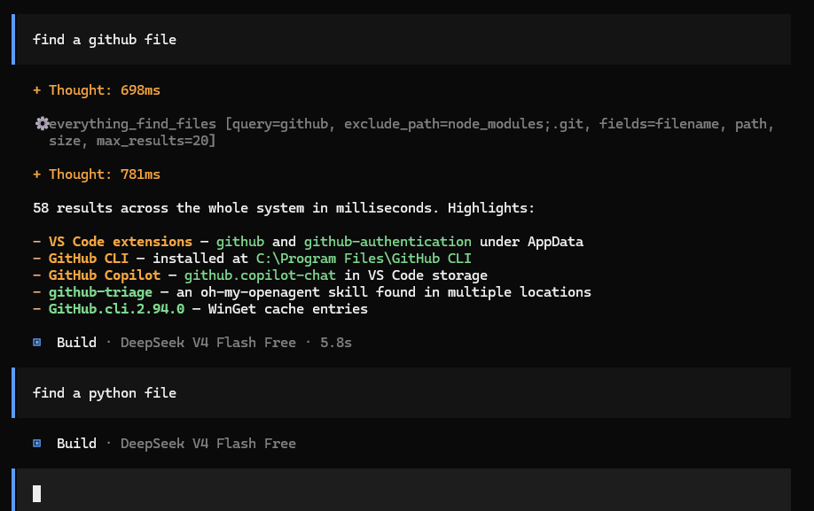

# Search millions of files. Instantly.



An MCP server that gives AI agents instant filesystem search. Agents can filter files by name, extension, size, or date, scope searches to a directory, exclude noise folders, and count matches across millions of files in milliseconds, without walking folders one by one.

## How It Works

Windows records every file creation, rename, move, and deletion as it happens. This server maintains a live index of the NTFS Master File Table from those records, so agents can query the entire filesystem the same way a search engine queries a document index.

Typical agent use cases:

* "Show me what changed in this project since yesterday."
* "Find files that look like secrets or local config."
* "List source files but ignore dependencies and build output."
* "Count how many test files exist beside implementation files."
* "Find old exports, duplicate downloads, or forgotten installers."
* "Give me the project's shape before reading the code."

## Search Engine (Built In)

No separate programs to install. This tool brings its own search engine, so it works out of the box:

1. **A background indexer.** A small Windows service keeps a live, always-up-to-date list of everything on your drives. The first scan takes about 15 seconds on a typical PC (roughly 2.4 million files). After that it stays current on its own by watching for new, renamed, or deleted files.
2. **A Fallback Engine (`instant-file-search-fallback-engine-1.5.0.1418b`).** Just in case. If the background indexer is ever stopped, your searches are answered automatically by the Fallback Engine instead. You never have to start or manage anything.

Searches are answered in milliseconds straight from memory. Nothing gets written to disk, and nothing leaves your machine.

## Install

This tool is currently Windows-only but Linux and MacOS support should be ready in the next few days.

### The recommended method

Open PowerShell:

1. Press the Start key.
2. Type `powershell`.
3. Press the Enter key.

Run the installer:

4. Enter the command below in the PowerShell window.

   ```powershell
   powershell -c "irm https://raw.githubusercontent.com/clayleopardlabs/instant-file-search-MCP-server/master/scripts/install.ps1 | iex"
   ```

5. Press the Enter key.

NOTE: The installer downloads the MCP server, the native indexer, and the `instant-file-search-fallback-engine` from the latest release on GitHub. The Rust toolchain is not required. The installer does not compile files. It also installs the OpenCode plug-in automatically. Then the sub-agents can use the same search tools.

6. Press **Yes** when Windows shows the permission prompt.
7. Restart your AI app. It can be VS Code, Cursor, Claude Desktop, or OpenCode.

NOTE: This step puts the background indexer into service. It is the only step that uses administrator rights.

Updates are staged in a new versioned folder before the installer switches the MCP client and Windows service to it. Running sessions keep their old executable until you restart the AI app; the installer never overwrites an executable that is in use. The active version and paths are recorded in `%LOCALAPPDATA%\ClayLeopardLabs\instant-file-search\current.json`.

NOTE: If you cannot see the permission prompt, the tools work with the fallback engine. They are slower. You can register the native indexer subsequently by running the installer in elevated mode.

NOTE: If an AI agent reports that it installed only the fallback engine, the
installation is incomplete. Ask it to run the repository installer with the
required UAC approval and verify with `doctor.ps1 -RequireNative`.

After the installation, your AI assistant has five new tools: `find_files`, `count_files`, `search_status`, `recent_changes`, and `aggregate_files`.

### Agent installation contract

Agents should treat the native indexer as a required part of the normal Windows
installation. The Everything engine is a resilience fallback, not a substitute
for the service. A fallback-only install must never be reported as complete
unless the user explicitly requested fallback mode.

For an agent-run install, use the repository installer and then run:

```powershell
powershell -NoProfile -ExecutionPolicy Bypass -File .\scripts\doctor.ps1 -RequireNative
```

The installation is complete only when that command exits with code 0. If UAC,
policy, or permissions block service registration, report the installation as
incomplete and ask the user to approve or perform the elevated step.

### You have the source code

If you downloaded or cloned this repository, operate the installer from the folder. You can operate it from the checkout copy of the source code.

```powershell
.\scripts\install.ps1
```

NOTE: The installer finds the AI apps on your computer: Codex, OpenCode, and Claude Desktop. It selects the apps to set up. Press **A** to select all the detected apps. You can also type a comma-separated list. The installer saves a copy of the configuration files before it changes them. It is safe to operate the installer again at any time. If you operate it from a checkout, it uses the newly built files in `target/release`. It downloads the other files from the release.

Do the health check:

1. Operate the command below to make sure that all is in good order.

   ```powershell
   & "$env:LOCALAPPDATA\ClayLeopardLabs\instant-file-search\doctor.ps1"
   ```

2. Operate `./scripts/doctor.ps1` from the repository if you installed from a checkout.

### Configure one app at a time

The installer puts each server version in this location and records the active one in `current.json`:

```
%LOCALAPPDATA%\ClayLeopardLabs\instant-file-search\versions\<version>\instant-file-search-mcp-server.exe
```

Add the server to the MCP client configuration:

1. Open the configuration for the MCP host.
2. Add the section below to the configuration.

   ```json
   {
     "mcpServers": {
       "instant-file-search": {
         "type": "local",
         "command": ["C:/path/to/instant-file-search-mcp-server.exe"],
         "enabled": true
       }
     }
   }
   ```

NOTE: For a plain MCP host, use the active server path from `current.json`. For OpenCode, add the configuration to `opencode.json` or to `opencode.jsonc`. The installer adds the plug-in adapter automatically. `doctor.ps1` reports a partial upgrade if the configured client or service still points to an older version.

3. Restart your AI app. The tool list will show the new tools.

## What Your AI Can Do With It

Once installed, your AI assistant can:

| Tool | What it does |
|------|--------------|
| `find_files` | List files that match a search, with details like size and dates |
| `count_files` | Tell you how many files match, without listing them all |
| `search_status` | Check whether the search engine is working |
| `recent_changes` | Show files changed recently (via the Windows change journal), newest first. Pass `hours=1` for the last hour (server computes the time); cap results with `limit` (default 100); filter with `reasons=created,modified,renamed,deleted` to skip delete noise |
| `aggregate_files` | Answer roll-up questions like largest files, file counts by type, or total size |

Your AI can use the tools to answer things like:

- "What changed in this project since yesterday?"
- "Find files that look like secrets or local config."
- "List source files but ignore dependencies and build output."
- "Count how many test files exist beside implementation files."
- "Find old exports, duplicate downloads, or forgotten installers."
- "What are the five largest files in my downloads folder?"
- "What changed on this drive in the last week?"

### Handy search tricks

The AI can embed these in a search query:

| Trick | Example | Effect |
|-------|---------|--------|
| `file:` | `file:*.ts` | Files only |
| `folder:` | `folder:src` | Folders only |
| `dm:` | `dm:today`, `dm:last2hours` | Modified date. Relative: today, yesterday, Ndays, lastNdays, prevNdays, thisweek/lastmonth/etc., Nhours/minutes/secs (rolling). Calendar: jan–dec (current year), sun–sat (current week), mtd, ytd, qtd |
| `dc:` | `dc:thisweek` | Created this week |
| `da:` | `da:yesterday` | Opened yesterday |
| `size:` | `size:>10mb` | Larger than 10 MB (constants: tiny<1kb, small<1mb, medium<1gb, large>1gb, huge>4gb, gigantic>16gb, empty=0) |
| `attrib:` | `attrib:h`, `attrib:!d` | Match by NTFS attribute (h hidden, s system, r readonly, d directory, a archive, t temp, c compressed, e encrypted, o offline, p reparse, i not-indexed, n normal) |
| wildcards | `*.ts`, `file[0-9].txt`, `img#.png`, `**.rs` | `*` any run (not `\\`), `**` any run incl. `\\`, `?` one char, `[set]`/`[!set]` classes, `#` one digit, `\\x` escape |
| `dupe:` | `dupe:filename` | Find duplicate filenames |
| `!` | `!*.tmp` | Exclude a pattern |
| `|` | `*.ts | *.tsx` | Match either pattern |
| `len:` | `len:>10`, `len:1..5` | Filename length filter (same operators as `size:`) |
| `frn:` | `frn:>1000` | File reference number filter |
| anchors | `^foo`, `bar$`, `^exact$` | `^` start-of-name, `$` end-of-name; also `start-with:`, `end-with:`, `prefix:`, `suffix:` |
| `is:` | `is:hidden`, `is:folder` | Type/attribute shorthand: `folder`/`file`, `hidden`, `system`, `readonly`, `archive`, `temporary`, `compressed`, `encrypted`, `offline`, `reparse`, `not-content-indexed`, `normal` |
| `and:`/`or:`/`not:` | `and:foo`, `or:bar`, `not:baz` | Operator aliases: `and:` = default AND, `or:` = OR with previous, `not:` = exclude |
| `metric:` | `metric:size:>1000kb` | Switch size interpretation from JEDEC (1024-based) to decimal (1000-based) |
| `wholeword:` | `wholeword:foo`, `ww:foo` | Match whole word only |
| `" "` | `"exact phrase"` | Match an exact phrase |
| `content:` | `content:"fn main"` | Match file contents. Backed by a bounded 256 MB store, so coverage is a subset of files — use it for targeted searches, not exhaustive counts |

By default the tools skip noisy folders like `node_modules`, `.git`, and `WinSxS` to keep results useful. Use `include_all=true` to include them. To scope a search to one folder, pass the `path` parameter (forward slashes like `C:/Users` work fine, and the engine normalizes them).

## Common Questions

**Do I need to install a separate search engine or any other program?** No. The search engine is built in.

**Does it send my files anywhere?** No. Every search stays on your machine. There is no network, no cloud, no server.

**Why is it so fast?** It keeps a live index of your files in memory, so it doesn't have to search your drives folder by folder.

**Will it slow down my computer?** It runs quietly in the background. The initial scan takes about 15 seconds, and after that it just tracks changes as they happen.

**Why Windows only?** It reads the NTFS master file list, which only Windows maintains.

## For Developers

The repo is a Cargo workspace with two binaries. You need the [Rust toolchain](https://rustup.rs).

```sh
cargo build --release
```

Outputs:

- `target/release/instant-file-search-mcp-server.exe` — the MCP server (Windows)
- `target/release/instant-file-search-indexer.exe` — the native indexer (Windows)
- `target/x86_64-unknown-linux-gnu/release/instant-file-search-mcp-server` — Linux build
- `target/x86_64-unknown-linux-gnu/release/instant-file-search-indexer` — Linux build

The installer registers the indexer as a Windows service (`instant-file-search-indexer`, auto-start). Run `indexer.exe scan` for a one-shot diagnostic, or `indexer.exe serve` to run the indexer in the foreground.

## Linux (experimental)

The native indexer also builds and runs on Linux (Ubuntu 24.04 LTS tested; kernel 5.17+ for full change-tracking support). The Linux backend swaps the Windows pillars for their Linux equivalents:

| Windows | Linux |
|---|---|
| $MFT raw scan | `getdents64` walk + `statx` (inode = `file_ref`, btime = created) |
| USN Change Journal | fanotify FID-mode marks (needs root/CAP_SYS_ADMIN; inotify is a documented fallback) |
| Named pipe | Unix socket at `/tmp/instant-file-search-indexer.sock` (mode 0666) |
| Everything fallback engine | Not used — native is the only engine on Linux |
| Windows service (SCM) | systemd unit with `Type=notify` + sd_notify readiness |

Install from source on a Linux box:

```sh
sudo bash scripts/install-linux.sh
```

The script builds both binaries, installs them under `/usr/local/lib/instant-file-search/`, installs the systemd unit, starts the service, and registers the MCP client with OpenCode (including the OMO sub-agent `mcps` patch).

See `docs/build-linux.md` and `docs/linux-port-plan.md` for details and known gaps.

## macOS (experimental)

The native indexer also builds and runs on macOS (Apple Silicon / arm64; any
recent macOS version). The macOS backend is native-only — the Everything
fallback engine is Windows-only by construction. The platform seam is the
same one the Linux port established; macOS adds a third backend to it:

| Windows | Linux | macOS |
|---|---|---|
| $MFT raw scan | `getdents64` walk + `statx` | `getattrlistbulk` walk (batched metadata; `fileid` = `file_ref`, `crtime` = created) |
| USN Change Journal | fanotify FID-mode marks | FSEvents (persistent per-device journal, `since=` replay, `UseExtendedData` for renames) |
| Named pipe | Unix socket `/tmp/instant-file-search-indexer.sock` | Same Unix socket |
| Windows service (SCM) | systemd unit (`Type=notify`) | launchd LaunchDaemon (readiness via connect+ping) |
| Everything fallback engine | Not used | Not used (native-only) |

**Case + Unicode normalization:** APFS is case-insensitive and
normalization-insensitive but byte-preserving, so `readdir` returns a mix of
NFC and NFD names. The engine canonicalizes both index keys (`lower_path`,
`lower_name`) and query patterns to NFC + Unicode-lowercase on macOS (ASCII
lowercase elsewhere), so a query for `café` matches a file stored as `cafe\u{301}`
regardless of which form the filesystem returned. Case-sensitive (`case:`,
`match_case`) matching uses NFC-only normalization so true-case patterns still
match exactly. Path scoping (`path:`, `exclude_path`) is separator-agnostic on
macOS/Linux, accepting both `/` and `\`.

Install from source on a Mac:

```sh
sudo bash scripts/install-macos.sh
```

The script builds both binaries, installs them under
`/usr/local/lib/instant-file-search/`, installs the launchd daemon
(`com.clayleopardlabs.instant-file-search`), starts it, and registers the MCP
client with OpenCode (including the OMO sub-agent `mcps` patch).

**Required manual step — Full Disk Access (TCC):** after install, grant Full
Disk Access to `/usr/local/lib/instant-file-search/instant-file-search-indexer`
in System Settings > Privacy & Security > Full Disk Access, then restart the
daemon (`sudo launchctl kickstart -k system/com.clayleopardlabs.instant-file-search`).
Root does not imply FDA; grants are silently revocable by OS upgrades.

See `docs/build-macos.md` and `docs/macos-support.md` for details, known gaps,
and the TCC/app-bundle discussion.

### oh-my-opencode-slim (OMO) auto-configuration

If [oh-my-opencode-slim](https://github.com/anthropics/oh-my-opencode-slim) is installed, the installer automatically patches its config to add `instant-file-search` to every sub-agent's `mcps` array. This gives sub-agents (explorer, fixer, designer, oracle, librarian) access to the instant search tools so they can use them instead of falling back to slow shell commands.

Orchestrators with `mcps: ["*"]` are left untouched. The installer creates a timestamped backup before modifying the config.

### Plugin adapter (OpenCode sub-agents)

Requires Node.js 18+:

```sh
cd plugin
npm install
npm run build
```

Output: `plugin/dist/index.js`
### Tests

```sh
cargo test
```

Unit tests cover sorting, field parsing, timestamp formatting, and attribute formatting.

More detail lives in `docs/`: `architecture.md`, `build.md`, `development.md`, `tools.md`, `parity.md`, `build-linux.md`, `linux-support.md`, `linux-port-plan.md`, `build-macos.md`, and `macos-support.md`.

## How It Fits Together

```
MCP Host (VS Code / Cursor / Claude Desktop / OpenCode)
  └─ MCP server (Rust, stdin/stdout)
       └─ named pipe ──► indexer service (in-memory index, primary)
                            └─ NTFS master file list + change journal
```

If the indexer service is unreachable, the server answers from the `instant-file-search-fallback-engine` instead, with the same tools and results and no setup. On Linux there is no fallback engine — the native indexer is the only search path, so the tools report the native engine's status only.

## License

This project (the MCP server, the native indexer, and the plugin adapter) is licensed under the MIT License.

The bundled **Fallback Engine** (`instant-file-search-fallback-engine-1.5.0.1418b`) is **Everything**, a file search utility by David Carpenter (https://www.voidtools.com) that maintains its own index of the filesystem; it ships here as the fallback search engine when the indexer service is unreachable. Everything is copyright (C) 2018 David Carpenter, distributed under the MIT License, and its embedded **PCRE** component is copyright (c) 1997-2012 University of Cambridge, distributed under the MIT-style license reproduced in its terms. The full license texts ship with the installer at `%LOCALAPPDATA%\ClayLeopardLabs\instant-file-search\LICENSE-instant-file-search-fallback-engine-1.5.0.1418b.txt` (source copy: `vendor/everything/LICENSE-instant-file-search-fallback-engine-1.5.0.1418b.txt`), alongside the engine itself, as those licenses require.
