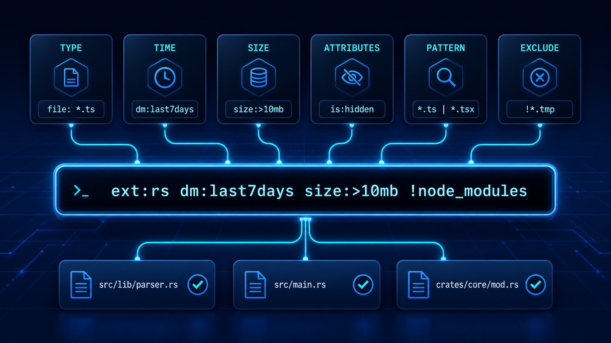
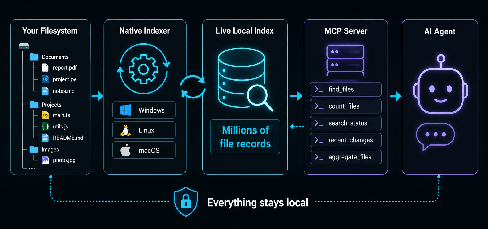

# Search all 3 million of your files. In milliseconds.


Windows, MacOS and Linux already know where every last file is.

Now your agents do too.


## How to Install (Recommended)

Have your AI agent do it:

```text
Install Instant File Search MCP from https://github.com/clayleopardlabs/instant-file-search-MCP-server for this computer and this AI app. Use the repository's recommended automatic installer for this operating system, configure this AI app, and complete the native indexer installation with any required OS permissions. Do not treat a fallback-only setup as complete. Verify the installation with the repository's documented diagnostic, restart this AI app if needed, then tell me which client was configured and whether verification passed.
```

Then the AI uses the following auto installers which pull from the releases. Which you can use manually yourself if you want. They detect if you have Hermes, opencode, and ohmyopencode. If you have OMO, normally subagents don't have access to top-level MCP servers so this adds a plugin to allow them to use the tools too. The goal is that the tools from instant-file-search become the new go-to tools instead of the much slower an inefficient defaults.

## Windows - Automatic installer

Detects a bunch of common programs like Codex and Opencode (and has plugins for ohmyopencode and omo-slim), installs the search service, and updates their configuration. You can safely run it again when a new version is available.

1. Open PowerShell.
2. Run:

   ```powershell
   powershell -c "irm https://raw.githubusercontent.com/clayleopardlabs/instant-file-search-MCP-server/master/scripts/install.ps1 | iex"
   ```

3. Approve the Windows permission prompt.
4. Restart your AI app.


To check the installation from a repository checkout:

```powershell
.\scripts\doctor.ps1 -RequireNative
```

If the check fails because Windows blocked the administrator step, the installation is incomplete. Approve the prompt and run the installer again.

## Linux - Automatic installer 

Linux:

```sh
sudo bash scripts/install-linux.sh
```

## MacOS - Automatic installer 

macOS:

```sh
sudo bash scripts/install-macos.sh
```

On macOS, grant Full Disk Access to the installed indexer in System Settings, then restart the launched service. See the platform-specific build guides below for the details and current limitations.

## What This Gives Your Agents

When you ask your agent to work on something the most tedious step is the first step. It has to go folder by folder peeking inside trying to find what it needs. 

Yes, of course you can run a /init and it makes a handy agents.md with a map, but even when you do that, it has to go folder by folder to make that map. It's silly. And it takes ages. Imagine if your /init was instantaneous.

Now they instantly know where every last file is. 


### 1. Understand an unfamiliar project in seconds

An agent can discover the shape of a codebase before touching the source:

> "Show me the project's source files, tests, configuration, generated output, and largest directories. Ignore dependencies and build artifacts."

It can then decide where to look instead of guessing from a shallow directory listing or spending minutes walking the tree.

### 2. Investigate what changed, not just what exists

`recent_changes` lets an agent answer questions that ordinary file search cannot:

- What changed in this project in the last hour?
- Which files were renamed or deleted during the failed build?
- What appeared after I installed this package?
- Show only created and modified files; hide delete noise.

The indexer records change events locally, at a forensic level: a file modified in only milliseconds still leaves evidence for the agent to find. This is especially useful for debugging, reviewing automated changes, and tracing unexpected activity. The tool returns events newest first.

### 3. Search the whole computer without drowning in results

Agents can search every indexed drive, then narrow the answer by folder, file type, date, size, or path. They can count first and list second:

> "How many JSON files are there outside dependencies? Now show me the first 30 under this project."

That lets an agent reason about scale before requesting thousands of results.

### 4. Answer questions involving totals and comparisons

`aggregate_files` gives the agent facts that normally require a shell script or a manual spreadsheet:

- total files and folders
- total disk space used
- largest matching entries
- counts and sizes grouped by extension

For example:

> "Which file types take the most space in this project, and what are the five largest files?"

The agent receives the answer directly instead of listing everything and trying to sum it inside the conversation.

### 5. Find secrets, stale artifacts, and suspicious leftovers

An agent can perform broad hygiene and forensic sweeps locally:

- find `.env`, credential, backup, dump, and installer files
- locate old exports and duplicate filenames
- find unexpectedly large files
- identify files created or modified during a suspicious time window
- search targeted text files with `content:"phrase"`

These searches are useful for security reviews, release preparation, incident triage, and cleaning up a project before sharing it.

### 6. Keep working at machine scale

The native index is designed for millions of files. The agent does not need to run slow recursive shell commands, ask you where every folder is, or read a directory listing into its context just to find one file. Search stays local, fast, and small enough to use repeatedly during a task.

### 7. Give sub-agents the same filesystem awareness

The optional OpenCode adapter exposes the same search abilities to sub-agents. An explorer can map a repository, a librarian can locate documentation, and a fixer can find related tests or configuration without falling back to slow shell scans.

The practical result is a different workflow: agents can discover, measure, investigate, and then read only the files that matter.

### 8. Know whether an answer is complete before relying on it

`search_status` gives the agent a coverage and health check before it begins an investigation. It can see whether the native index is available, how many files are indexed, and which volumes are covered. That means the agent can recognize the difference between "nothing matched" and "the search service is not ready," and can explain when a result is based on a fallback or a limited content index.


##  Save your start-up tokens. Only adds 5 new tools.


You agent gets 5 new tools:

| Tool | What it does |
|------|--------------|
| `find_files` | Discover the exact files an agent should read, with names, paths, dates, sizes, and filters |
| `count_files` | Measure the size of a search before returning a large result set |
| `search_status` | Confirm which local search engine is available and whether the index is healthy |
| `recent_changes` | Investigate what was created, modified, renamed, or deleted, newest first |
| `aggregate_files` | Answer roll-up questions like largest files, file counts by type, or total size |

You could ask it very specific questions like, 

- "Find the project's README file."
- "Show me the largest files in this folder, ignoring build output."
- "List source files but ignore dependencies and build output."
- "Show me what changed in this project since yesterday."
- "Find files that look like secrets or local config."
- "How many JSON files are on this computer?"
- "Count how many test files exist beside implementation files."
- "Find old exports, duplicate downloads, or forgotten installers."
- "Give me the project's shape before reading the code."

...but 99% of the time my agents use it automatically. When they're working on a codebase and need to know where that library is or when they're trying to find some config file on my computer, etc. Or this past week when I was doing a reinstall of Windows and needed to backup my Witcher 3 save files.

By default, searches are answered in milliseconds straight from memory. Nothing leaves your machine.

### Choose a storage mode

The indexer has two modes. Memory mode is the default.

| Mode | Good for | Cost |
|------|----------|------|
| `memory` | Fastest searches and users with plenty of RAM | Keeps the full file index in RAM. The optional `content:` cache can use up to 256 MiB more. |
| `disk` | Computers where RAM is limited, including local AI systems | Keeps file metadata in SQLite on disk. It uses much less process RAM, but searches and the first scan take longer. |

To use disk mode, set `INSTANT_FS_INDEX_MODE=disk` for the indexer service.
`search_status` reports the active `storage_mode` and database path. The default
database location is `%PROGRAMDATA%\ClayLeopardLabs\instant-file-search\index.sqlite3`
on Windows, `/Library/Application Support/instant-file-search/index.sqlite3`
on macOS, and `/var/lib/instant-file-search/index.sqlite3` on Linux. Override it
with `INSTANT_FS_INDEX_PATH`.

Content search has its own setting. `INSTANT_FS_CONTENT_INDEX=memory` keeps a
small content cache in RAM. `INSTANT_FS_CONTENT_INDEX=disk` keeps the content
index in the SQLite database and works with disk metadata mode. This saves RAM
but uses more disk space and makes the first content build take longer.
`INSTANT_FS_CONTENT_INDEX=off` disables content search. The default `auto`
setting uses memory content with memory metadata and disables content indexing
with disk metadata. The disk content budget is 2 GB by default and can be
changed with `INSTANT_FS_CONTENT_DISK_BUDGET` in bytes.

The database is durable. In disk mode, Windows and macOS normally resume after
a restart by replaying filesystem changes from the saved checkpoint. They do a
full scan only on the first run, when the checkpoint is missing, or when the
operating system says the saved change history is no longer available. Linux
still scans after a restart because its watcher has no persistent history.

### Measured memory and speed

We created the same 500,000 synthetic file records in a fresh release-build
process for each mode. The test measures the process working set after the index
is built, then runs the same three searches. It does not include the optional
content cache or operating system file cache.

| Operation | Memory mode | Disk mode |
|-----------|------------:|----------:|
| Process RAM after indexing | 500 MiB | 10 MiB |
| Build index | 954 ms | 8.71 s |
| Search for one filename | 68 ms | 417 ms |
| Search for `*.rs` | 844 ms | 1.82 s |
| Search for a module name | 62 ms | 420 ms |

For a repeatable comparison, build the release indexer and run
`instant-file-search-indexer benchmark memory 500000` and
`instant-file-search-indexer benchmark disk 500000`.

### Search query filters

Your agent has endless options for narrowing down a search:



| Trick | Example | Effect |
|-------|---------|--------|
| `file:` | `file: *.ts` | Files only |
| `folder:` | `folder: src` | Folders only |
| `dm:` | `dm:today`, `dm:last2hours` | Modified date. Relative: today, yesterday, Ndays, lastNdays, prevNdays, thisweek/lastmonth/etc., Nhours/minutes/secs (rolling). Calendar: jan-dec (current year), sun-sat (current week), mtd, ytd, qtd |
| `dc:` | `dc:thisweek` | Created this week |
| `da:` | `da:yesterday` | Opened yesterday |
| `size:` | `size:>10mb` | Larger than 10 MB (constants: tiny<1kb, small<1mb, medium<1gb, large>1gb, huge>4gb, gigantic>16gb, empty=0) |
| `attrib:` | `attrib:h`, `attrib:!d` | Match by NTFS attribute (h hidden, s system, r readonly, d directory, a archive, t temp, c compressed, e encrypted, o offline, p reparse, i not-indexed, n normal) |
| wildcards | `*.ts`, `file[0-9].txt`, `img#.png`, `**.rs` | `*` any run (not `\\`), `**` any run incl. `\\`, `?` one char, `[set]`/`[!set]` classes, `#` one digit, `\\x` escape |
| `dupe:` | `dupe:filename` | Find duplicate filenames |
| `!` | `!*.tmp` | Exclude a pattern |
| `|` | `*.ts | *.tsx` | Match either pattern |
| `len:` | `len:>10`, `len:1..5` | Filename length filter (same operators as `size:`) |
| `frn:` | `frn:>1000` | File reference number filter |
| anchors | `^foo`, `bar$`, `^exact$` | `^` start-of-name, `$` end-of-name; also `start-with:`, `end-with:`, `prefix:`, `suffix:` |
| `is:` | `is:hidden`, `is:folder` | Type/attribute shorthand: `folder`/`file`, `hidden`, `system`, `readonly`, `archive`, `temporary`, `compressed`, `encrypted`, `offline`, `reparse`, `not-content-indexed`, `normal` |
| `and:`/`or:`/`not:` | `and:foo`, `or:bar`, `not:baz` | Operator aliases: `and:` = default AND, `or:` = OR with previous, `not:` = exclude |
| `metric:` | `metric:size:>1000kb` | Switch size interpretation from JEDEC (1024-based) to decimal (1000-based) |
| `wholeword:` | `wholeword:foo`, `ww:foo` | Match whole word only |
| `" "` | `"exact phrase"` | Match an exact phrase |
| `content:` | `content:"fn main"` | Match file contents. Backed by a bounded 256 MB store, so coverage is a subset of files; use it for targeted searches, not exhaustive counts |

Noisy folders such as `node_modules`, `.git`, and `WinSxS` are skipped by default so results stay useful. When a task genuinely requires a complete inventory, the agent can include those folders with `include_all=true`. Folder scoping also accepts ordinary paths such as `C:/Users`; the engine normalizes path separators for the agent.

### How it works

What instant-file-search-MCP-server does is let your agent cheat by maintaining its own list of your files so it doesn't have to tediously search every time you ask it to find something. 



First, it catches up by sneaking a peak at the current one your computer already has, then starting from what's already there, uses that to maintain its own super fast copy. When you delete, move or rename something its list is updated so it doesn't get out of date. That's it. That's the trick. 

Now when you ask your agent to /init and learn a new codebase, it can find every single file in milliseconds. It knows where every agents.md file is, whether it's in the /docs folder or in the /.opencode folder. It finds all of them instantly.

### Forensic in practice

A file modified in milliseconds still leaves a trace your agent can now find. You can have your agent find every file modified by that new program you installed or keep an eye on things. It now keeps tabs on your PC on the same hardware level as the programs we used in my Information Security classes. 

### Frequently asked questions

**Do I need to install another search program?**

No. The installer includes everything the tool needs.

**Does anything leave my computer?**

Never ever. Searches run completely locally. Your file names, file contents, and search results are not sent to any cloud service or leave your computer in any way. At least not by this MCP server, what you do with your AI and where you send your info is your business. 

**How is it this fast?**

The tool prepares a local index in the background. Your AI can search that index instead of opening every folder one at a time. 

**Will it slow down my computer?**

No. The first scan builds the index. After that, the background service watches for changes and updates the list it made the first time. My AI buddies are telling me that given how linux inodes work (what a weird system) they could be slower to build the index the first time, but when I tested it on Ubuntu LTS on a 15 yr old i5 work laptop with a 15 yr old SSD, I didn't notice anything. 

**What happens if the background service is unavailable?**

Windows: Hooray! You get a fallback search engine. It's the called the Everything engine made by void-tools. It doesn't have every last feature my native engine has but it's serviceable if you need it. I might pull it from future releases and just keep it in the repo for testing purposes, but for now this project is smart enough to know when the native engine is down and immediately use the backup.

Linux and macOS: sorry, you can only use the native indexer, so if there's a problem it'll tell you. Truth is, aside from a bad installation I can't imagine there's going to be a time when the native engine fails but the backup doesn't, so you're not missing anything.

(okay the human's getting tired so AI will take over from here on down)

**What permissions does it need?**

Windows needs administrator approval once to install the background service. On macOS, Full Disk Access must also be granted manually in System Settings if you want to search protected folders such as Documents or Desktop.

**How do I know it's working?**

Ask your AI assistant to run `search_status`, or use the platform health-check command described below.

### Endlessly tested

I tested this MCP server with a dozen different models from tiny locally hosted Qwen models and mid size 35b models, and API sized 400b models like deepseek and chatgpt. The only problem I found was a ChatGPT model (luna) trying get away with only half installing it. After you install it, just confirm with your agent that they installed everything.


## Technical Details

The following sections are for developers, advanced users, and anyone who wants to understand how the system works under the hood.

### Search Engine (Built In)

No separate programs to install. This tool brings its own search engine, so it works out of the box:

1. **A background indexer.** A small service keeps a live, always-up-to-date list of everything on your drives. It runs as a Windows service on Windows, a systemd unit on Linux, or a launchd daemon on macOS. The first scan takes about 15 seconds on a typical Windows PC (roughly 2.4 million files). After that it stays current on its own by watching for new, renamed, or deleted files.
2. **A Fallback Engine (`instant-file-search-fallback-engine-1.5.0.1418b`).** Just in case. If the background indexer is ever stopped, your searches are answered automatically by the Fallback Engine instead. You never have to start or manage anything. It is a Windows-native engine (Everything) that ships with the release installer; Linux and macOS use the native indexer exclusively.

Searches are answered in milliseconds straight from memory. Nothing gets written to disk, and nothing leaves your machine.

### Detailed Installation Reference

The one-line installer command shown in Install on Windows is the recommended method. Notes for agents and power users:

- The installer downloads the MCP server, the native indexer, and the `instant-file-search-fallback-engine` from the latest release on GitHub. The Rust toolchain is not required; the installer does not compile files. It also installs the OpenCode plug-in automatically so sub-agents can use the same search tools.
- Approving the permission prompt is the only step that uses administrator rights; it puts the background indexer into service. If you cannot see the permission prompt, the tools work with the fallback engine (they are slower). You can register the native indexer subsequently by running the installer in elevated mode.
- If an AI agent reports that it installed only the fallback engine, the installation is incomplete. Ask it to run the repository installer with the required UAC approval and verify with `doctor.ps1 -RequireNative`.
- Updates are staged in a new versioned folder before the installer switches the MCP client and Windows service to it. Running sessions keep their old executable until you restart the AI app; the installer never overwrites an executable that is in use. The active version and paths are recorded in `%LOCALAPPDATA%\ClayLeopardLabs\instant-file-search\current.json`.

#### Agent installation contract

Agents should treat the native indexer as a required part of the normal Windows installation. The Everything engine is a resilience fallback, not a substitute for the service. A fallback-only install must never be reported as complete unless the user explicitly requested fallback mode.

For an agent-run install, use the repository installer and then run:

```powershell
powershell -NoProfile -ExecutionPolicy Bypass -File .\scripts\doctor.ps1 -RequireNative
```

The installation is complete only when that command exits with code 0. If UAC, policy, or permissions block service registration, report the installation as incomplete and ask the user to approve or perform the elevated step.

#### You have the source code

If you downloaded or cloned this repository, operate the installer from the folder. You can operate it from the checkout copy of the source code.

```powershell
.\scripts\install.ps1
```

The installer finds the AI apps on your computer: Codex, OpenCode, Claude Desktop, and Hermes. It selects the apps to set up. Press **A** to select all the detected apps, or type a comma-separated list. The installer saves a copy of the configuration files before it changes them. It is safe to operate the installer again at any time. If you operate it from a checkout, it uses the newly built files in `target/release` and downloads the other files from the release.

Do the health check:

1. Run the command below to make sure that all is in good order.

   ```powershell
   & "$env:LOCALAPPDATA\ClayLeopardLabs\instant-file-search\doctor.ps1"
   ```

2. Operate `./scripts/doctor.ps1` from the repository if you installed from a checkout.

#### Configure one app at a time

The installer puts each server version in this location and records the active one in `current.json`:

```
%LOCALAPPDATA%\ClayLeopardLabs\instant-file-search\versions\<version>\instant-file-search-mcp-server.exe
```

Add the server to the MCP client configuration:

1. Open the configuration for the MCP host.
2. Add the section below to the configuration.

   ```json
   {
     "mcpServers": {
       "instant": {
         "type": "local",
         "command": ["C:/path/to/instant-file-search-mcp-server.exe"],
         "enabled": true
       }
     }
   }
   ```

For a plain MCP host, use the active server path from `current.json`. For OpenCode, add the configuration to `opencode.json` or `opencode.jsonc`. For Hermes, add the server under `mcp_servers` in `%LOCALAPPDATA%\hermes\config.yaml` (or the directory selected by `HERMES_HOME`):

   ```yaml
   mcp_servers:
     instant:
       command: 'C:\path\to\instant-file-search-mcp-server.exe'
       enabled: true
   ```

The Windows installer writes this Hermes entry automatically and preserves the rest of the YAML file. The installer adds the OpenCode plug-in adapter automatically. `doctor.ps1` reports a partial upgrade if the configured client or service still points to an older version.

3. Restart your AI app. The tool list will show the new tools.

### For Developers

The repo is a Cargo workspace with two binaries. You need the [Rust toolchain](https://rustup.rs).

```sh
cargo build --release
```

Outputs:

- `target/release/instant-file-search-mcp-server.exe` - the MCP server (Windows)
- `target/release/instant-file-search-indexer.exe` - the native indexer (Windows)
- `target/x86_64-unknown-linux-gnu/release/instant-file-search-mcp-server` - Linux build
- `target/x86_64-unknown-linux-gnu/release/instant-file-search-indexer` - Linux build

The installer registers the indexer as a Windows service (`instant-file-search-indexer`, auto-start). Run `indexer.exe scan` for a one-shot diagnostic, or `indexer.exe serve` to run the indexer in the foreground.

### Linux

The native indexer runs on Linux. Tested on Ubuntu 26.04 LTS, kernel 7.0, x86_64. The Linux backend swaps the Windows pillars for their Linux equivalents:

| Windows | Linux |
|---|---|
| $MFT raw scan | `getdents64` walk + `statx` (inode = `file_ref`, btime = created) |
| USN Change Journal | fanotify FID-mode marks (needs root/CAP_SYS_ADMIN; inotify is a documented fallback) |
| Named pipe | Unix socket at `/tmp/instant-file-search-indexer.sock` (mode 0666) |
| Everything fallback engine | Not used; native is the only engine on Linux |
| Windows service (SCM) | systemd unit with `Type=notify` + sd_notify readiness |

Install from source on a Linux box with the command shown in Start Here. The script builds both binaries, installs them under `/usr/local/lib/instant-file-search/`, installs the systemd unit, starts the service, and registers the MCP client with OpenCode (including the OMO sub-agent `mcps` patch).

See `docs/build-linux.md` and `docs/linux-port-plan.md` for details and known gaps.

**Note:** `/tmp` is typically tmpfs (RAM-backed) and is excluded from the indexer scan. Use paths on real disk volumes (e.g. `/home`, `/var`, `/usr`) for test files.

### macOS (experimental)

The native indexer also builds and runs on macOS (Apple Silicon / arm64; any recent macOS version). The macOS backend is native-only: the Everything fallback engine is Windows-only by construction. The platform seam is the same one the Linux port established; macOS adds a third backend to it:

| Windows | Linux | macOS |
|---|---|---|
| $MFT raw scan | `getdents64` walk + `statx` | `getattrlistbulk` walk (batched metadata; `fileid` = `file_ref`, `crtime` = created) |
| USN Change Journal | fanotify FID-mode marks | FSEvents (persistent per-device journal, `since=` replay, `UseExtendedData` for renames) |
| Named pipe | Unix socket `/tmp/instant-file-search-indexer.sock` | Same Unix socket |
| Windows service (SCM) | systemd unit (`Type=notify`) | launchd LaunchDaemon (readiness via connect+ping) |
| Everything fallback engine | Not used | Not used (native-only) |

**Case + Unicode normalization:** APFS is case-insensitive and normalization-insensitive but byte-preserving, so `readdir` returns a mix of NFC and NFD names. The engine canonicalizes both index keys (`lower_path`, `lower_name`) and query patterns to NFC + Unicode-lowercase on macOS (ASCII lowercase elsewhere), so a query for `café` matches a file stored as `cafe\u{301}` regardless of which form the filesystem returned. Case-sensitive (`case:`, `match_case`) matching uses NFC-only normalization so true-case patterns still match exactly. Path scoping (`path:`, `exclude_path`) is separator-agnostic on macOS/Linux, accepting both `/` and `\`.

Install from source on a Mac with the command shown in Start Here. The script builds both binaries, installs them under `/usr/local/lib/instant-file-search/`, installs the launchd daemon (`com.clayleopardlabs.instant-file-search`), starts it, and registers the MCP client with OpenCode (including the OMO sub-agent `mcps` patch).

**Required manual step - Full Disk Access (TCC):** after install, grant Full Disk Access to `/usr/local/lib/instant-file-search/instant-file-search-indexer` in System Settings > Privacy & Security > Full Disk Access, then restart the daemon (`sudo launchctl kickstart -k system/com.clayleopardlabs.instant-file-search`). Root does not imply FDA; grants are silently revocable by OS upgrades.

See `docs/build-macos.md` and `docs/macos-support.md` for details, known gaps, and the TCC/app-bundle discussion.

#### oh-my-opencode and slim (OMO) auto-configuration for subagents

If [oh-my-opencode-slim](https://github.com/anthropics/oh-my-opencode-slim) is installed, the installer automatically patches its config to add `instant` to every sub-agent's `mcps` array. This gives sub-agents (explorer, fixer, designer, oracle, librarian) access to the instant search tools so they can use them instead of falling back to slow shell commands.

Orchestrators with `mcps: ["*"]` are left untouched. The installer creates a timestamped backup before modifying the config.

#### Hermes Auto Config

Installer detects Hermes and autoconfigures the MCP server

#### Plugin adapter (OpenCode sub-agents)

Requires Node.js 18+:

```sh
cd plugin
npm install
npm run build
```

Output: `plugin/dist/index.js`

#### Tests

```sh
cargo test
```

Unit tests cover sorting, field parsing, timestamp formatting, and attribute formatting.

More detail lives in `docs/`: `architecture.md`, `build.md`, `development.md`, `tools.md`, `parity.md`, `build-linux.md`, `linux-support.md`, `linux-port-plan.md`, `build-macos.md`, and `macos-support.md`.

## How It Fits Together

```
MCP Host (VS Code / Cursor / Claude Desktop / OpenCode / Hermes)
  └─ MCP server (Rust, stdin/stdout)
       └─ named pipe ──► indexer service (in-memory index, primary)
                            └─ NTFS master file list + change journal
```

On Windows, if the indexer service is unreachable, the server answers from the `instant-file-search-fallback-engine` instead, with the same tools and results and no setup. On Linux and macOS the native indexer is the only engine.

## License

This project (the MCP server, the native indexer, and the plugin adapter) is licensed under the MIT License.

The bundled **Fallback Engine** (`instant-file-search-fallback-engine-1.5.0.1418b`) is **Everything**, a file search utility by David Carpenter (https://www.voidtools.com) that maintains its own index of the filesystem; it ships here as the fallback search engine when the indexer service is unreachable. Everything is copyright (C) 2018 David Carpenter, distributed under the MIT License, and its embedded **PCRE** component is copyright (c) 1997-2012 University of Cambridge, distributed under the MIT-style license reproduced in its terms. The full license texts ship with the installer at `%LOCALAPPDATA%\ClayLeopardLabs\instant-file-search\LICENSE-instant-file-search-fallback-engine-1.5.0.1418b.txt` (source copy: `vendor/everything/LICENSE-instant-file-search-fallback-engine-1.5.0.1418b.txt`), alongside the engine itself, as those licenses require.
