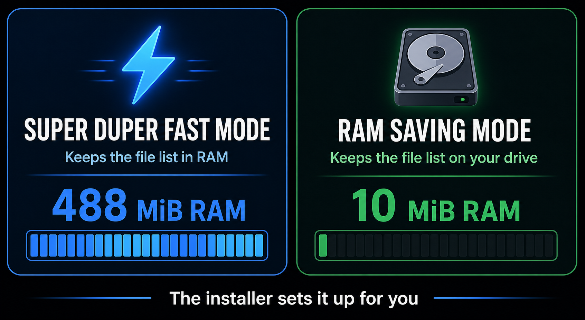

# Search all 3 million of your files. In milliseconds.


Windows, MacOS and Linux already know where every last file is.

Now your agents do too.


## Real life examples

I screwed up and moved all my LM Studio models to the wrong folder, stopped copying halfway through, and messed up the entire directory structure. I didn't know which files to save or where to move them. Using Instant File Search tools, the agent quickly found all the files and determined how to fix the mess.


## How to Install (Recommended)

Have your AI agent do it:

```text
Install Instant File Search MCP from https://github.com/clayleopardlabs/instant-file-search-MCP-server for this computer and this AI app. Use the repository's recommended automatic installer for this operating system, configure this AI app, and complete the native indexer installation with any required OS permissions. Do not treat a fallback-only setup as complete. Verify the installation with the repository's documented diagnostic, restart this AI app if needed, then tell me which client was configured and whether verification passed.
```

Then the AI uses the following auto installers which pull from the releases. Which you can use manually yourself if you want. They detect if you have Hermes, opencode, and ohmyopencode. If you have OMO, normally subagents don't have access to top-level MCP servers so this adds a plugin to allow them to use the tools too. The goal is that the tools from instant-file-search become the new go-to tools instead of the much slower an inefficient defaults.

## Windows - Automatic installer

Detects a bunch of common programs like Codex and Opencode (and has plugins for ohmyopencode and omo-slim), installs the search service, and updates their configuration. You can safely run it again when a new version is available.

1. Open PowerShell.
2. Run:

   ```powershell
   powershell -c "irm https://raw.githubusercontent.com/clayleopardlabs/instant-file-search-MCP-server/master/scripts/install.ps1 | iex"
   ```

3. Approve the Windows permission prompt.
4. Restart your AI app.


To check the installation from a repository checkout:

```powershell
.\scripts\doctor.ps1 -RequireNative
```

If the check fails because Windows blocked the administrator step, the installation is incomplete. Approve the prompt and run the installer again.

## Linux - Automatic installer 

Linux:

```sh
sudo bash scripts/install-linux.sh
```

To use the low-RAM mode and keep content search on disk, run:

```sh
sudo bash scripts/install-linux.sh --index-mode disk --content-mode disk
```

## MacOS - Automatic installer 

macOS:

```sh
sudo bash scripts/install-macos.sh
```

The macOS installer accepts the same `--index-mode` and `--content-mode`
options. Windows accepts `-IndexMode` and `-ContentMode` in PowerShell.

On macOS, grant Full Disk Access to the installed indexer in System Settings, then restart the launched service. See the platform-specific build guides below for the details and current limitations.

## What This Gives Your Agents

When you ask your agent to work on something the most tedious step is the first step. It has to go folder by folder peeking inside trying to find what it needs. 

Yes, of course you can run a /init and it makes a handy agents.md with a map, but even when you do that, it has to go folder by folder to make that map. It's silly. And it takes ages. Imagine if your /init was instantaneous.

Now they instantly know where every last file is. 


### 1. Understand an unfamiliar project in seconds

An agent can discover the shape of a codebase before touching the source:

> "Show me the project's source files, tests, configuration, generated output, and largest directories. Ignore dependencies and build artifacts."

It can then decide where to look instead of guessing from a shallow directory listing or spending minutes walking the tree.

### 2. Investigate what changed, not just what exists

`recent_changes` lets an agent answer questions that ordinary file search cannot:

- What changed in this project in the last hour?
- Which files were renamed or deleted during the failed build?
- What appeared after I installed this package?
- Show only created and modified files; hide delete noise.

The indexer records change events locally, at a forensic level: a file modified in only milliseconds still leaves evidence for the agent to find. This is especially useful for debugging, reviewing automated changes, and tracing unexpected activity. The tool returns events newest first.

### 3. Search the whole computer without drowning in results

Agents can search every indexed drive, then narrow the answer by folder, file type, date, size, or path. They can count first and list second:

> "How many JSON files are there outside dependencies? Now show me the first 30 under this project."

That lets an agent reason about scale before requesting thousands of results.

### 4. Answer questions involving totals and comparisons

`aggregate_files` gives the agent facts that normally require a shell script or a manual spreadsheet:

- total files and folders
- total disk space used
- largest matching entries
- counts and sizes grouped by extension

For example:

> "Which file types take the most space in this project, and what are the five largest files?"

The agent receives the answer directly instead of listing everything and trying to sum it inside the conversation.

### 5. Find secrets, stale artifacts, and suspicious leftovers

An agent can perform broad hygiene and forensic sweeps locally:

- find `.env`, credential, backup, dump, and installer files
- locate old exports and duplicate filenames
- find unexpectedly large files
- identify files created or modified during a suspicious time window
- search targeted text files with `content:"phrase"`

These searches are useful for security reviews, release preparation, incident triage, and cleaning up a project before sharing it.

### 6. Keep working at machine scale

The native index is designed for millions of files. The agent does not need to run slow recursive shell commands, ask you where every folder is, or read a directory listing into its context just to find one file. Search stays local, fast, and small enough to use repeatedly during a task.

### 7. Give sub-agents the same filesystem awareness

The optional OpenCode adapter exposes the same search abilities to sub-agents. An explorer can map a repository, a librarian can locate documentation, and a fixer can find related tests or configuration without falling back to slow shell scans.

The practical result is a different workflow: agents can discover, measure, investigate, and then read only the files that matter.

### 8. Know whether an answer is complete before relying on it

`search_status` gives the agent a coverage and health check before it begins an investigation. It can see whether the native index is available, how many files are indexed, and which volumes are covered. That means the agent can recognize the difference between "nothing matched" and "the search service is not ready," and can explain when a result is based on a fallback or a limited content index.


##  Save your start-up tokens. Only adds 5 new tools.


You agent gets 5 new tools:

| Tool | What it does |
|------|--------------|
| `find_files` | Discover the exact files an agent should read, with names, paths, dates, sizes, and filters |
| `count_files` | Measure the size of a search before returning a large result set |
| `search_status` | Confirm which local search engine is available and whether the index is healthy |
| `recent_changes` | Investigate what was created, modified, renamed, or deleted, newest first |
| `aggregate_files` | Answer roll-up questions like largest files, file counts by type, or total size |

You could ask it very specific questions like, 

- "Find the project's README file."
- "Show me the largest files in this folder, ignoring build output."
- "List source files but ignore dependencies and build output."
- "Show me what changed in this project since yesterday."
- "Find files that look like secrets or local config."
- "How many JSON files are on this computer?"
- "Count how many test files exist beside implementation files."
- "Find old exports, duplicate downloads, or forgotten installers."
- "Give me the project's shape before reading the code."

...but 99% of the time my agents use it automatically. When they're working on a codebase and need to know where that library is or when they're trying to find some config file on my computer, etc. Or this past week when I was doing a reinstall of Windows and needed to backup my Witcher 3 save files.

By default, searches are answered in milliseconds straight from memory. Nothing leaves your machine.

### Choose a storage mode

Instant File Search defaults to RAM saving mode. It stays in the mode it was
installed with. Super duper fast mode is useful when you have plenty of RAM,
especially if your computer has an old or slow hard drive. It keeps the file
list in RAM, so searches do not have to wait on the drive.



### Speed and RAM usage

Here is what we saw with 500,000 test files on Windows. RAM saving mode used
about 49 times less RAM, 10 MiB instead of 488 MiB. Finding one filename took
about twice as long, 87 ms instead of 38 ms. Some broad searches were faster
in RAM saving mode.

| What we measured | Super duper fast mode | RAM saving mode |
|------------------|------------:|----------:|
| RAM used after indexing | 488 MiB | 10 MiB |
| Time to build the index | 735 ms | 6.84 s |
| Find one filename | 38 ms | 87 ms |
| Find `*.rs` files | 515 ms | 340 ms |
| Find a module name | 36 ms | 92 ms |

### Search query filters

Your agent has endless options for narrowing down a search:


| Trick | Example | Effect |
|-------|---------|--------|
| `file:` | `file: *.ts` | Files only |
| `folder:` | `folder: src` | Folders only |
| `dm:` | `dm:today`, `dm:last2hours` | Modified date. Relative: today, yesterday, Ndays, lastNdays, prevNdays, thisweek/lastmonth/etc., Nhours/minutes/secs (rolling). Calendar: jan-dec (current year), sun-sat (current week), mtd, ytd, qtd |
| `dc:` | `dc:thisweek` | Created this week |
| `da:` | `da:yesterday` | Opened yesterday |
| `size:` | `size:>10mb` | Larger than 10 MB (constants: tiny<1kb, small<1mb, medium<1gb, large>1gb, huge>4gb, gigantic>16gb, empty=0) |
| `attrib:` | `attrib:h`, `attrib:!d` | Match by NTFS attribute (h hidden, s system, r readonly, d directory, a archive, t temp, c compressed, e encrypted, o offline, p reparse, i not-indexed, n normal) |
| wildcards | `*.ts`, `file[0-9].txt`, `img#.png`, `**.rs` | `*` any run (not `\\`), `**` any run incl. `\\`, `?` one char, `[set]`/`[!set]` classes, `#` one digit, `\\x` escape |
| `dupe:` | `dupe:filename` | Find duplicate filenames |
| `!` | `!*.tmp` | Exclude a pattern |
| `|` | `*.ts | *.tsx` | Match either pattern |
| `len:` | `len:>10`, `len:1..5` | Filename length filter (same operators as `size:`) |
| `frn:` | `frn:>1000` | File reference number filter |
| anchors | `^foo`, `bar$`, `^exact$` | `^` start-of-name, `$` end-of-name; also `start-with:`, `end-with:`, `prefix:`, `suffix:` |
| `is:` | `is:hidden`, `is:folder` | Type/attribute shorthand: `folder`/`file`, `hidden`, `system`, `readonly`, `archive`, `temporary`, `compressed`, `encrypted`, `offline`, `reparse`, `not-content-indexed`, `normal` |
| `and:`/`or:`/`not:` | `and:foo`, `or:bar`, `not:baz` | Operator aliases: `and:` = default AND, `or:` = OR with previous, `not:` = exclude |
| `metric:` | `metric:size:>1000kb` | Switch size interpretation from JEDEC (1024-based) to decimal (1000-based) |
| `wholeword:` | `wholeword:foo`, `ww:foo` | Match whole word only |
| `" "` | `"exact phrase"` | Match an exact phrase |
| `content:` | `content:"fn main"` | Match file contents. Backed by a bounded 256 MB store, so coverage is a subset of files; use it for targeted searches, not exhaustive counts |

Noisy folders such as `node_modules`, `.git`, and `WinSxS` are skipped by default so results stay useful. When a task genuinely requires a complete inventory, the agent can include those folders with `include_all=true`. Folder scoping also accepts ordinary paths such as `C:/Users`; the engine normalizes path separators for the agent.

### How it works

What instant-file-search-MCP-server does is let your agent cheat by maintaining its own list of your files so it doesn't have to tediously search every time you ask it to find something. 


First, it catches up by sneaking a peak at the current one your computer already has, then starting from what's already there, uses that to maintain its own super fast copy. When you delete, move or rename something its list is updated so it doesn't get out of date. That's it. That's the trick. 

Now when you ask your agent to /init and learn a new codebase, it can find every single file in milliseconds. It knows where every agents.md file is, whether it's in the /docs folder or in the /.opencode folder. It finds all of them instantly.

### Forensic in practice

A file modified in milliseconds still leaves a trace your agent can now find. You can have your agent find every file modified by that new program you installed or keep an eye on things. It now keeps tabs on your PC on the same hardware level as the programs we used in my Information Security classes. 

### Frequently asked questions

**Do I need to install another search program?**

No. The installer includes everything the tool needs.

**Does anything leave my computer?**

Never ever. Searches run completely locally. Your file names, file contents, and search results are not sent to any cloud service or leave your computer in any way. At least not by this MCP server, what you do with your AI and where you send your info is your business. 

**How is it this fast?**

The tool prepares a local index in the background. Your AI can search that index instead of opening every folder one at a time. 

**Will it slow down my computer?**

No. The first scan builds the index. After that, the background service watches for changes and updates the list it made the first time. My AI buddies are telling me that given how linux inodes work (what a weird system) they could be slower to build the index the first time, but when I tested it on Ubuntu LTS on a 15 yr old i5 work laptop with a 15 yr old SSD, I didn't notice anything. 

**What happens if the background service is unavailable?**

Windows: Hooray! You get a fallback search engine. It's the called the Everything engine made by void-tools. It doesn't have every last feature my native engine has but it's serviceable if you need it. I might pull it from future releases and just keep it in the repo for testing purposes, but for now this project is smart enough to know when the native engine is down and immediately use the backup.

Linux and macOS: sorry, you can only use the native indexer, so if there's a problem it'll tell you. Truth is, aside from a bad installation I can't imagine there's going to be a time when the native engine fails but the backup doesn't, so you're not missing anything.

(okay the human's getting tired so AI will take over from here on down)

**What permissions does it need?**

Windows needs administrator approval once to install the background service. On macOS, Full Disk Access must also be granted manually in System Settings if you want to search protected folders such as Documents or Desktop.

**How do I know it's working?**

Ask your AI assistant to run `search_status`, or use the platform health-check command described below.

### Endlessly tested

I tested this MCP server with a dozen different models from tiny locally hosted Qwen models and mid size 35b models, and API sized 400b models like deepseek and chatgpt. The only problem I found was a ChatGPT model (luna) trying get away with only half installing it. After you install it, just confirm with your agent that they installed everything.


## Technical details

Developer setup, platform notes, architecture, and license information are in
[Technical details](docs/technical-details.md).
